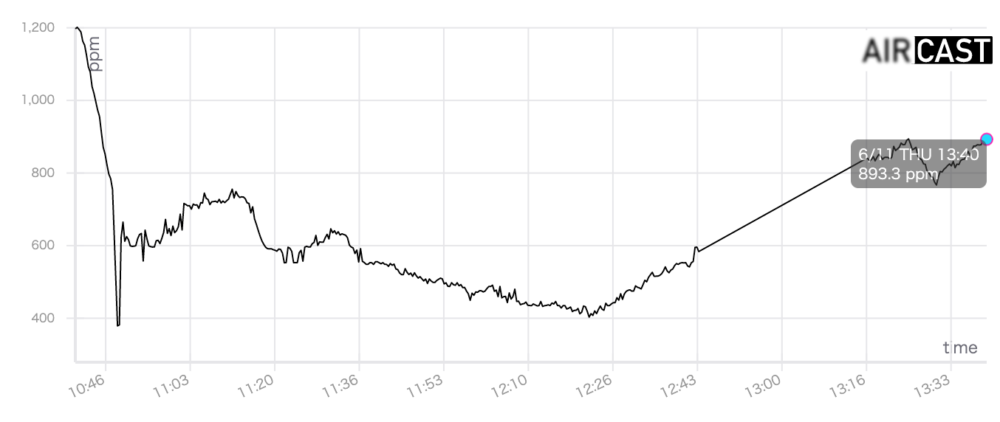

# AirCast front-end


Data visualization component for [AirCast](https://github.com/P-A-N/AirCast_M5Stack)


## setup

    ```
    npm i react react-dom react-vis firebase query-string sass typescript react-firebase-hooks react-router-dom parcel-bundler 
    npm i -D @types/react @types/react-dom @types/react-router-dom
    ```


## run
    ```
    npx parcel src/index.html
    ```